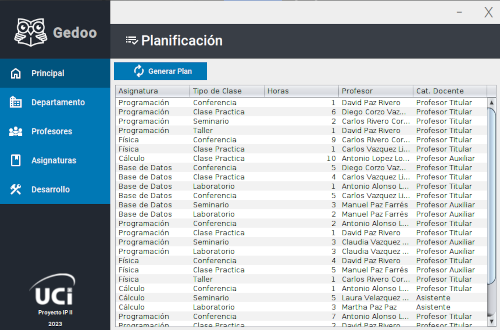
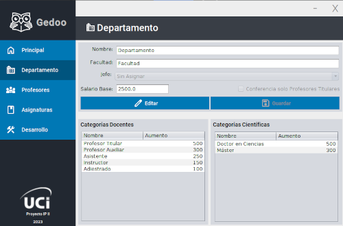
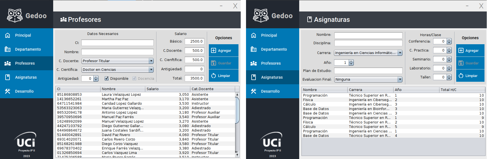
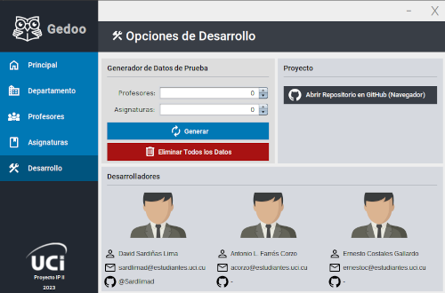

# GestorDocente
Gedoo es un Gestor de Carga Docente desarrollado en Java. Este software se encarga de administrar la distribución de asignaturas entre los profesores de un Departamento. 
Permite el registro de profesores y asignaturas, y luego asigna las asignaturas a los profesores de siguiendo determinados criterios. 
Gedoo es una herramienta útil para los departamentos académicos que buscan optimizar la distribución de carga de trabajo entre sus profesores.

## Introducción
El proyecto UCi tiene como objetivo automatizar la planificación de la carga docente de un departamento específico. Esto implica la asignación de profesores a las distintas asignaturas que se deben impartir en un semestre.

El departamento a planificar se caracteriza por su nombre, la facultad a la que pertenece, el nombre del jefe del departamento, los profesores y la relación de las asignaturas que debe impartir en el semestre.

Cada profesor del departamento se identifica por su número de identidad, nombre y apellidos, categoría docente (Profesor Titular, Profesor Auxiliar, Asistente, Instructor, Adiestrado), categoría científica (Doctor en Ciencias, Máster) y salario, que varía en función de la categoría docente, la antigüedad y el pago por la categoría científica.

Las asignaturas se identifican por su nombre, la disciplina a la que pertenecen, la cantidad de horas por cada tipo de enseñanza (conferencia, clase práctica, seminario, laboratorio, taller), el plan de estudio al que pertenecen, la carrera y el año en que se imparten y si tienen o no evaluación final, y en caso de tenerla, incluye el tipo de evaluación final (exámen, trabajo de curso).

Para la planificación se considerará la disponibilidad de los profesores en el periodo, es decir, en el caso de los profesores adiestrados, en su primer año de trabajo, deben contar con la autorización de la universidad para impartir docencia.

Además, en la planificación se debe tener en cuenta que las conferencias deben ser impartidas por Profesores Titulares siempre que sea posible. También se establece un límite de que en una semana un profesor no puede impartir más de 12 horas de clases.

Este es el problema que el proyecto UCi busca resolver de manera eficiente y efectiva, contribuyendo a una planificación académica exitosa y potenciando el ambiente de aprendizaje tanto para estudiantes como educadores.

##### Condiciones para la planificación
* Disponibilidad del profesor.
* Los Adiestrados, en su primer año de trabajo necesitan autorización de la universidad para impartir docencia.
* Las clases de Conferencia deben ser impartidas por Profesores Titulares.
* En una semana un profesor no debe impartir más de 12 horas de clase.

## Diagrama de Clases UML

[Diagrama de clases UML (PDF)](readme/diagrama-clases-UML.pdf)

## Descripción del Proyecto

La clase principal del proyecto es `GestorDocente`, que es la clase de interfaz gráfica. En esta clase se controlan los componentes de interfaz gráfica
y los eventos que estos generan.

### Clase Departamento
Es la clase controladora, a través de la cual se manipulan los datos de profesores y asignaturas, entre otros.
Esta clase contiene una `Lista` de tipo `Profesor`, una de tipo `Asignatura`, otros atributos, incluyendo los métodos get u set de algunos de estos, 
así como varios arrays que almacenan los posibles valores que puede tomar Categoría Docente, Categoría Científica, Carrera. 
Contiene los métodos para gestionar(agregar, editar y eliminar) tanto profesores como asignaturas y el método clave del proyecto `setPlan()`, 
para crear la planificación, y otros métodos auxiliares.

## Interfaz Gráfica
La interfaz gráfica está compuesta por un jFrame, y dentro de este un jPanel que agrupa todos los componentes.

### Componente Menú
Es un jPanel que se encuentra en la parte lateral izquiera, es común para todas las vistas. Contiene otros jPanel que hacen función de botones para navegar por las diferentes vistas. Contiene el logo y nombre de la aplicación y de la UCI.

### Vista Principal/Planificación



En esta vista se encuentra un botón para crear la planificación y un jTable que es donde se muestra.

*¿Cómo se crea la planificación?*

El método `setPlan()` en la clase Departamento es el encargado de realizar la asignación de profesores a las diferentes asignaturas.

1. Se llama al método `isSetteablePlan()` el cual verifica si se cumple el requisito mínimo para que sea posible hacer una distribución, 
o sea si la sumatoria de horas clases de todas las asignaturas es menor o igual que la cantidad de profesores multimplicada por las horas máximas permitidas para cada profesor(12).
1. Se llama al método `suficientesTitulares()` para comporbar si hay suficientes titulares siempre y cuando se halla establecido que solo los Profesores Tiutlares pueden imparir conferencia(explicación más adelante).
1. Si alguna de estas dos condiciones anteriores no se cumple se muestra un jOptionPanel comunicando la causa del error al usuario.
1. Si ambas condiciones son superadas, se procede a ejecutar el método `agruparProfe()`, que devuelve a los profesores agrupados por categoría docentes.
Se crea un array de Lista<Profesor> de tamaño 5(Categorias Docentes). Donde en la posición 0 del array se almacena la Lista de los Profesores Titulares,
en la posición 1 la Lista de Profesores Auxiliares, posición 2 a los Asistentes, posición 3 a los Instructores, posición 4 los Adiestrados.

Ejemplo:


1. Luego se itera(i) por los tipos de clase(Conferencia, Clase Práctica, Seminario, Laboratorio, Taller).
1. Se itera(j) por las Lista de Asignaturas
1. Se itera(k) por el array de Lista<Profesor> agrupados por categoría docente. De este modo se garantiza que la docencia sea impartida por los profesores más calificados, en la medida de lo posible. Se 
1. Se itera(l) por la Lista<Profesor> de una categoría `k < 5`, se determina cuál de estos profesores tiene menor horas de clase asignadas y si la cantidad de horas
que posee actualmente sumadas a las horas del tipo de clase(i) de la Asignatura (j) es menor o igual a 12(máximo de horas permitidas), entonces se le asigna ese turno al profesor(l) y se rompe el ciclo pasando a la próxima asignatura.
1. Luego en la Vista Principal se renderiza la tabla de planficiación con los datos creados.

### Vista Departamento
Se muestra un formulario para editar los atriburos del Departamento, y dos tablas que muestran las categorías docentes y científicas y sus respectivos montos de aumento al salario básico de los profesores.



### Vistas Profesores y Asignaturas

En ambas vistas se muestra un formulario para crea sus respectivos objetos y una tabla para mostrarlos; al seleccionar un elemento de la tabla y click derecho sobre este, se muestra un menú con las opciones: editar y eliminar. 
En la vista profesores se calcula dinámicamente el salario del profesor a medida que se va proporcionando los datos de categoría científica, docente y los años de antigüedad. Si se selecciona la categoría Adiestrado, el jCheckField 
correspondiente a el autorizo para impartir docencia se activa o desactiva en función de la cantidad de años de antigüedad.



### Vista Desarrollo

Se muestra un botón que lleva al repositorio del proyecto en GitHub, información de contacto de los desarrolladores y lo más importante: un fromulario que permite crear datos de prueba, especificando, a través de dos jSpinner, 
la cantidad de Asignaturas y de Profesores que se deseen.

Estos datos son creados al ejecutar el método `seed(int asigs, int profes)`, donde **asigs** y **profes** son la cantidad de asignaturas y profesores respectivamente. 
Este método hace uso de la clase estática Seeder, la cual posee un array de nombres propios, apellidos, nombres de asignaturas, etc, y los mezcla de manera aleatoria para
crear objetos de tipo Profesor y Asignaturas con información que parezca real. 



## Misceláneo

### Clase Tema
Para el diseño de la interfaz gráfica se implementó la clase `Tema` que contiene 4 atributos que almacenan colores RGB, 
todos los colores de la UI se basan en estos cuatro.

Siéntase libre de modificar los colores RGB para darle el estilo deseado. 

```java
public class Tema {

    //Cambie por los colores de su preferencia
    private static Color primary = new Color(34, 40, 49);
    private static Color secondary = new Color(57, 62, 70);
    private static Color button = new Color(0, 120, 181);
    private static Color background = new Color(238, 238, 238);

    ....
```

Obtención del color de un botón, para cuando el mouse se coloca sobre este, a partir del color original del botón, haciendo uso de la función `darker()`.
```java

    public static Color getButtonHover() {
        return button.darker();
    }

```

### Clase Validacion
Para garantizar que en los jTextField se introduzcan datos acorde a lo que se pide y no se produzcan excepciones inesperadas,
se implementó la clase estática `Validacion`.

En el siguiente código se muestra como se controla que en el campo `facultadDeptoTxt` se puedan introducir solo 50 caracteres que deben ser alfanuméricos:
```java
Validacion.Alphanumeric(evt, facultadDeptoTxt, 50);
```